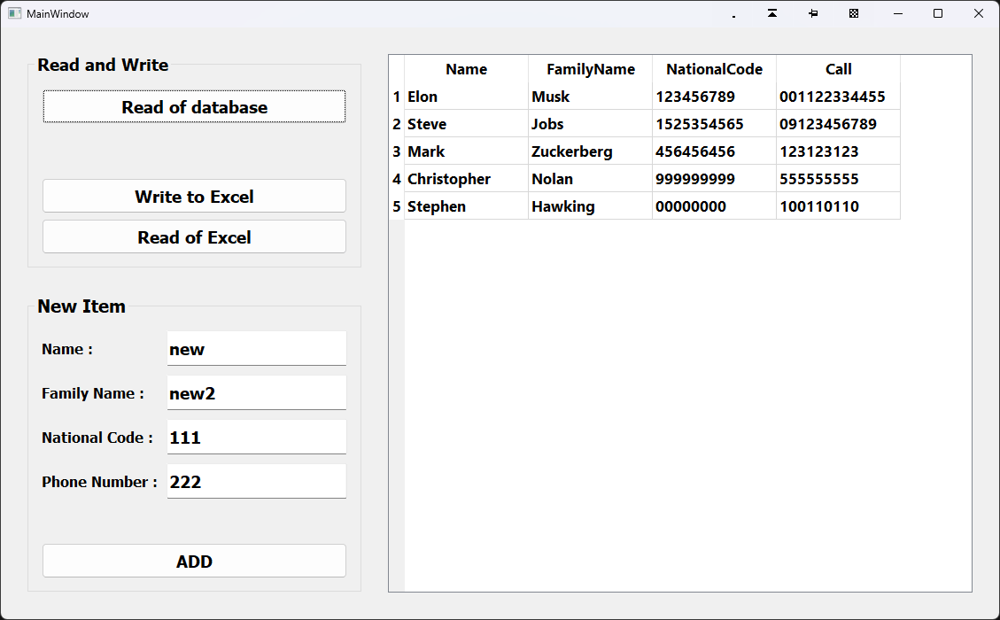

# Personal-information_QXlsx

This project is a simple **Excel Project** to *Write* and *Read* a table in an Excel file .

In this project, we use the ready-made **QXlsx library** .

---

1. Read of Database and write to Excel
2. Read of Excel and write or insert in to Database
3. Add a new item or record in to Database

---
 

